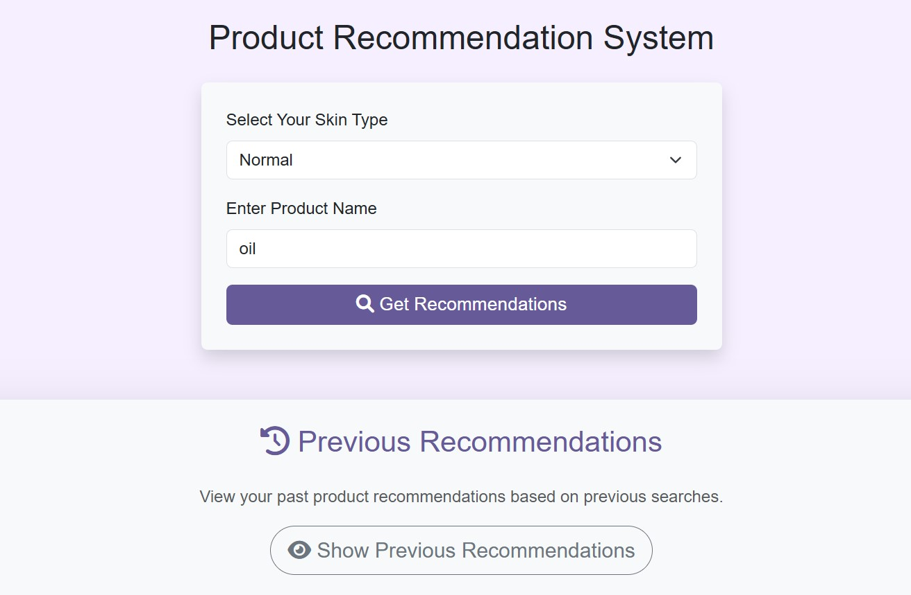
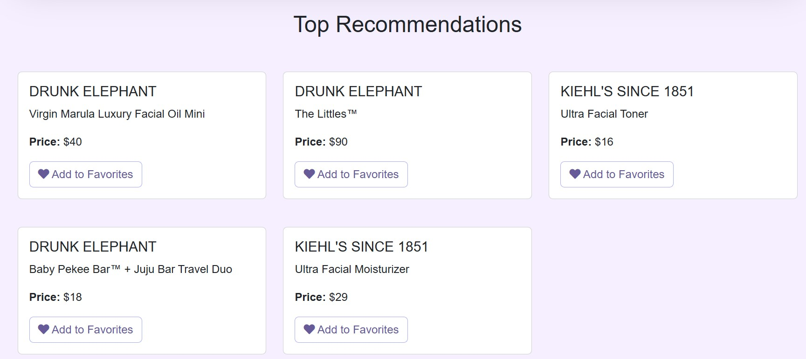

# Product Recommendation System

A web-based recommendation system for skincare products that suggests items based on user input such as skin type and product preferences. This project uses Flask for the backend, a recommendation model implemented with scikit-learn, and a responsive frontend built with Bootstrap.




## Table of Contents
- [Overview](#overview)
- [Features](#features)
- [Tech Stack](#tech-stack)
- [Installation](#installation)
- [Usage](#usage)
- [Project Structure](#project-structure)
- [Contributing](#contributing)
- [License](#license)

## Overview

This project aims to create a personalized product recommendation experience for skincare enthusiasts. Users can select their skin type and input a product name, and the system will provide suggestions based on similarity with other products. The recommendations are dynamically generated using TF-IDF and cosine similarity.

## Features

- **Dynamic Recommendations**: Suggests products based on user-provided skin type and product name.
- **Previous Recommendations**: Allows users to view previous recommendations stored in the browser’s `localStorage`.
- **Responsive Design**: Built with Bootstrap for a user-friendly experience on any device.

## Tech Stack

- **Backend**: Python, Flask
- **Frontend**: HTML, CSS, JavaScript, Bootstrap
- **Data Processing**: pandas, scikit-learn (TF-IDF and cosine similarity)

## Installation

### Prerequisites
- Python 3.x
- Flask
- pandas
- scikit-learn

### Steps

1. **Clone the Repository**:
   ```bash
   git clone https://github.com/your-username/product-recommendation-system.git
   cd product-recommendation-system
2. **Set Up a Virtual Environment**:
    ```bash
    python -m venv env
    source env/bin/activate  # On Windows use `env\Scripts\activate`
3. **Run Flask Application**:
    ```bash
    python recomend.py

### The application will run on http://127.0.0.1:5000

## Demo

- Navigate to http://127.0.0.1:5000 in browser.
- Get Recommendations - Select a skin type and enter a product name
- Click Get Recommendations to view similar products based on your input.
- Click Show Previous Recommendations to view saved recommendations stored in localStorage.


